# Visit Bridge: complete product schematic

## 1. The project in one sentence

**Visit Bridge is an offline-first, voice-centered tool that helps a frontline primary-care worker turn their own approved decision into a clear next step the patient can understand before leaving the clinic.**

The worker captures the plan by speaking or typing. A small on-device AI organizes the worker’s words, flags anything uncertain or missing, and prepares a short explanation in one validated local language. The worker reviews and approves it. The patient hears or reads that approved explanation, with a simple paper card as a reminder. A small AR replay layer can be added after the core handoff works.

**The worker decides what should happen. Visit Bridge helps record and communicate that decision. It does not diagnose, prescribe, triage, or choose a referral.**

## 2. Why this project fits this specific challenge

The Health track is part of the World Bank’s **Small AI for Development** challenge, not a general “build an AI health app” competition. The brief asks for a targeted tool that works in the conditions of its intended users: limited connectivity, constrained devices, local languages, and varying digital literacy. It asks teams to show that the essential function works offline, that the model can be side-loaded or sent over a weak connection, that at least one interaction uses a named local language, and that a person makes the final call. The brief also asks entrants to explain what their AI does and why a simpler tool would not do the same job. [Challenge 4a concept note](/Users/acordero/Downloads/c4a.pdf)

The health scenario describes an overcrowded nearby clinic, uneven care quality, workers who may not always be up to date with guidance, and documentation demands that reduce the attention available to each patient. The annex specifically invites solutions addressing **one meaningful part** of primary-care access or frontline-worker capacity, including documentation, referral, follow-up, or continuity of care.

Visit Bridge chooses one of those allowed slices: **the end-of-visit handoff**. It does not claim to improve clinical decisions or replace a health worker. It aims to make the worker’s existing decision easier to capture and understand.

There is an important boundary in the health annex: it describes image-based screening as an area with strong evidence, but explicitly says the health track provides no medical imaging or diagnosis datasets because interpretation is out of bounds. Visit Bridge avoids that route. It does not need diagnostic data, patient images, or disease classification.

## 3. The problem, stated precisely

A patient in a remote catchment may travel a long way and wait for a short consultation. At the end, the worker must communicate what the patient should do next, and may also need to record that plan. If the worker is overloaded and the patient has limited literacy, prefers a local language, or cannot rely on internet or personal smartphone access, the last few minutes of the visit can be a fragile point in the care journey.

The problem is not that the patient needs an AI doctor. The problem is that **a worker-approved next step may be hard to document, explain, and remember under time and access constraints.**

> **Need statement:** A frontline primary-care worker serving a remote, low-connectivity community needs a quick, reliable way to capture and explain the next step they have already decided, in a form the patient can understand and refer back to, so that a brief visit does not end with an unclear or forgotten plan.

This is a focused hypothesis grounded in the challenge scenario. It still needs local validation: the brief does not name the actual country, clinic workflow, frontline-worker role, or language the team will represent.

## 4. The scenario we are designing for

The challenge’s Noor is fictional, but the brief says her constraints draw on real World Bank-supported work. The health scenario gives her a nearby clinic that is overcrowded and may provide uneven-quality care. The shared persona context adds device and connectivity constraints:

- Noor has a basic phone she uses for calls, messages, and mobile money.
- A household smartphone belongs to her daughter and is only available at home on weekends.
- There is no home Wi-Fi; the household buys mobile-data bundles.
- Noor spends most of the day away from the house, where the phone is kept.
- Low digital literacy and local-language needs can limit the value of a patient-facing smartphone app.

**Design consequence:** Visit Bridge should not require Noor to own a smartphone, install an app, or have data at home. The primary interface is for the worker on a compatible device that the worker or clinic already has. The worker can play the approved explanation before Noor leaves and provide a portable paper summary if available.

That device is still an assumption to validate. The project must name whose existing device runs the model. If the target worker does not already have access to a compatible device, the app would miss the challenge’s “device the user already has” requirement.

## 5. What the project promises—and what it does not

### The promise

Before the patient leaves, the worker can capture the next step, review it, explain it in a supported local language, and check whether the patient understood the key action. The core journey works offline.

### The project does not promise

- More clinicians or shorter queues.
- Better diagnosis or more current clinical guidance.
- Fewer missed visits or improved health outcomes without appropriate evaluation.
- General translation across all local languages.
- A replacement for the clinic’s official record system.
- That every patient can independently use a smartphone.
- That digital tools can solve the underlying health-system constraints.

WHO’s digital-health guideline emphasizes that digital interventions are not substitutes for a functioning health system and that they have limits. This is a strength to acknowledge, not a weakness to hide. [WHO recommendations on digital interventions](https://www.who.int/publications/i/item/9789241550505/)

The scale of workforce constraints reinforces why the tool must be modest in its claims. WHO currently estimates a projected global shortfall of **11 million health workers by 2030**, mostly in low- and lower-middle-income countries, with additional deployment challenges in rural and remote areas. Visit Bridge cannot solve that shortage; its narrow aim is to reduce friction in one communication step. [WHO health workforce overview](https://www.who.int/health-topics/health-workforce)

World Bank Service Delivery Indicator surveys across seven low- and middle-income countries reported provider absenteeism of **14.3–44.3%**, daily productivity of **5.2–17.4 patients per provider**, diagnostic accuracy of **34–72.2%**, and adherence to guidelines of **22–43.8%**. These are cross-country findings from the report, not figures for Noor’s clinic, not current estimates for a chosen country, and not proof that Visit Bridge will improve productivity or quality. They do support the brief’s broader point that service conditions can vary substantially. [World Bank, *Delivering Quality Health Services*](https://documents1.worldbank.org/curated/en/482771530290792652/pdf/127816-REVISED-quality-joint-publication-July2018-Complete-vignettes-ebook-L.pdf)

## 6. Who uses it

**Primary user: the frontline primary-care worker.** This could be a nurse or another authorized clinic worker, but the team should choose a specific role before implementation. Scope of practice, clinic workflow, and documentation expectations differ.

**Secondary user: the patient or caregiver.** The patient receives a clear version of the worker-approved next step. They do not need to use an app themselves.

**The exact moment:** the final part of the visit, after the worker has made their decision and before the patient leaves.

The app is not an ambient recorder for the whole consultation. It captures only the information needed for the handoff and only when the worker actively starts the flow.

## 7. The end-to-end experience

1. **The worker starts the handoff.** The app opens a new encounter. It clearly shows whether it is online or offline. For the prototype, use synthetic patient information and avoid names unless essential.

2. **The worker captures what they decided.** They speak a short note or enter it in a form. The worker can distinguish their own plan from information reported by the patient. The prototype should focus on administrative next steps—such as return date, referral destination already chosen by the worker, or a document to bring—rather than treatment advice.

3. **On-device AI creates a draft.** It transcribes or accepts the worker’s words and organizes them into fixed fields:
   - patient-reported concern, if included;
   - worker’s approved decision or next step;
   - time or date, if stated;
   - place or destination, if stated;
   - item to bring or follow-up task, if stated;
   - unresolved or missing details.

4. **The app checks for uncertainty.** It identifies ambiguous speech, unclear dates, incomplete phrases, or unsupported language content. It asks the worker to correct the issue instead of guessing.

5. **The worker reviews the exact wording.** The draft is editable. The worker can correct, reject, or delete it. The app makes clear that it is an AI-organized draft, not a clinical recommendation.

6. **The worker approves the patient-facing explanation.** Only after approval does the app render or speak the final summary. A visible “approved by worker” state makes the human decision point obvious.

7. **The worker explains the plan.** The device displays large text and/or plays audio in the selected language. The worker can replay the message or clarify it.

8. **The worker checks understanding.** The worker asks the patient to explain the next step in their own words. Visit Bridge can record a simple worker-marked result—“understood,” “clarified,” or “needs follow-up.” It should not score the patient or claim to measure medical comprehension scientifically.

9. **The handoff is saved locally.** It remains available on-device without internet. The app can provide a simple paper summary or card if the build supports printing; if not, the screen remains available for the worker to show.

10. **Optional synchronization happens later.** A future deployment could sync an authorized minimum record to an existing health system when connectivity is available. The hackathon prototype should not send patient data to a cloud model or pretend that it integrates with a real national record system.

## 8. What the worker sees

### Home screen

- **New handoff**
- **Saved handoffs** (only if the prototype needs revisiting)
- **Offline / online status**
- **Language pack available / unavailable**
- A visible privacy or lock control

The interface should not add an elaborate patient-management dashboard unless it is necessary for the demo. This is an end-of-visit communication aid, not a second electronic health record.

### Capture screen

- A large “record short note” button.
- A text-entry alternative.
- The selected language and input mode.
- A visible recording indicator and stop control.
- A brief notice explaining that only a short handoff note is captured.
- A transcript area that the worker can edit.

### Review screen

- Worker-entered source note.
- AI-organized draft with fields separated.
- Missing or low-confidence fields clearly flagged.
- Edit, discard, and approve controls.
- No clinical-sounding certainty badge.

### Patient explanation screen

- One action per line.
- Large readable text.
- Audio playback / replay.
- Simple icon or pictogram where appropriate.
- Worker-facing “clarify” and “confirm understanding” actions.

## 9. AI design: useful, bounded, and visible

The core AI task should be **speech and language transformation of the worker’s own information**, not medical reasoning.

### AI capabilities in the prototype

Depending on the selected language and available model, the system may:

- transcribe a brief worker voice note on-device;
- structure that note into a fixed set of fields;
- identify missing or ambiguous fields;
- produce a concise explanation based only on the worker-approved plan;
- provide text or audio in one named, validated local language.

### Deterministic safeguards around the model

The model does not control the user journey. The product wraps AI with predictable rules:

- Required fields are defined by the selected workflow.
- Dates must be explicitly stated or selected by the worker.
- The app does not add a diagnosis, medicine, dosage, urgency, or warning sign.
- If the text contains a clinical instruction that the system cannot safely support in the chosen language, the worker must use the original language or a validated human-reviewed phrase.
- The worker’s source note remains visible beside the AI draft.
- Approval is required before the patient-facing output is shown as final.
- An unresolved field remains unresolved; the system does not fill it from general knowledge.

### What happens when the model is unsure

Use plain, actionable prompts:

- “I couldn’t hear the date. Please enter it or leave it blank.”
- “This phrase may have changed meaning. Please review before approval.”
- “This language is not available offline. Use the approved text or ask a language speaker.”
- “I’m not sure what the next step is. Please enter it yourself.”

The challenge brief explicitly calls for a fail-safe such as “not sure—ask a person” when the data is insufficient, and a human stays in the loop.

## 10. Local language and localization

The project cannot remain at “supports local languages.” The submission must **name the language** it demonstrates and explain how it would perform in a less-supported language.

No country or language has been selected in our conversation. The final schematic therefore cannot responsibly pick one. Before building, the team must choose a real target context and answer:

- Which local language does the worker or patient use for this interaction?
- Which language does the worker use to dictate?
- Are they the same language?
- Is speech recognition available offline for that language and likely dialect?
- Is text-to-speech available and understandable?
- Who will review the healthcare wording?
- What will the tool do when speech recognition fails?

The hackathon brief lists candidate language resources such as **Common Voice, FLEURS, MMS, FLORES-200/NLLB-200, OPUS, MASSIVE, Masakhane, and AI4Bharat**. These can help locate models, corpora, or benchmarks, but their existence does not prove performance on a local dialect, a noisy clinic recording, or health-related phrases. The team should record the dataset/model name, version, license, size, supported language, and known coverage gaps.

A practical localization approach is to treat it as more than translation:

1. Choose the local workflow and language with input from a fluent speaker or relevant health worker.
2. Prepare a small, reviewed set of common handoff phrases or content.
3. Test dates, numbers, names, abbreviations, code-switching, and likely background noise.
4. Compare the AI output with the worker’s intended meaning.
5. Let the worker reject the output.
6. Describe what the system does not support.

If an under-resourced language lacks reliable offline speech support, do not fake it with a fluent-sounding generic translation. A safer prototype may use typed input plus carefully reviewed recorded phrases, while stating that this is a limitation. But the submission still needs to demonstrate at least one genuine, named local-language interaction.

## 11. Offline and device schematic

The required core journey should work without a network:

```mermaid
flowchart LR
    A[Worker speaks or types] --> B[On-device transcription]
    B --> C[Small model structures draft]
    C --> D[Validator flags missing or uncertain details]
    D --> E[Worker edits and approves]
    E --> F[Local-language explanation]
    F --> G[Patient listens or reads]
    G --> H[Worker checks understanding]
    H --> I[Encrypted local save]
    I -. optional, later .-> J[Authorized sync when connected]
```

The major system components are:

- **Offline-capable interface:** local app shell and essential assets remain usable without network.
- **Local speech component:** only if it genuinely works on the target phone and chosen language without a connection.
- **Small language model:** limited to transcription follow-up, field extraction, or constrained paraphrasing.
- **Structured-data validator:** checks fields and confidence; prevents unsupported content from being treated as complete.
- **Reviewed language content:** selected phrases, templates, or speech assets stored locally.
- **Local encrypted storage:** stores only the information required for the handoff.
- **Optional sync boundary:** clearly separate, disabled in the demo unless safely implemented and justified.

The brief defines offline/on-device AI as running the model on the user’s device rather than a server; it also says model files must be small enough to side-load or send over a weak connection. The team should report the model’s actual size and test the core interaction in airplane mode. Do not rely on browser speech recognition that silently calls a cloud service and then call the app offline.

## 12. Data and evidence plan

The competition brief distinguishes between **data that establishes the problem** and **data the tool learns from or is tested against**. Visit Bridge should keep that distinction clear.

### Evidence that the problem exists

The health annex suggests:

- **World Bank Service Delivery Indicators (SDI):** provider absenteeism, caseload, equipment, infrastructure, and medicine availability.
- **DHS / Service Provision Assessments:** health-seeking behavior and facility conditions.
- **WHO Global Health Observatory:** country-level health and workforce indicators.
- **Healthsites.io / Maina et al. facility lists / Malaria Atlas travel time / AccessMod:** if the team needs to substantiate distance and access in a chosen geography.
- **DHIS2:** an example of a health information platform used in many ministries, useful for discussing institutional fit if the project eventually connects to records.

These sources can support the context, but they do not prove that this exact handoff is a problem in a chosen clinic. Cite the actual country and year if available; label modeled or older data accurately.

### Data used by or tested with the tool

Visit Bridge should not need to train a medical model on patient data. Suitable prototype inputs are:

- synthetic worker notes, clearly labeled synthetic;
- public speech resources for testing or evaluating language support, after checking their license;
- a small, consented set of test phrases recorded by fluent speakers, if the team can obtain appropriate consent and use them safely;
- a locally approved handoff template or phrases, if a real context has been selected.

Do not train on the competition persona and present that as representative. Do not use medical imaging or diagnostic datasets. List every source, license, version, and limitation in the README or submission.

### Model evaluation

Test the important failure cases, not only a happy-path sentence:

- omitted date;
- ambiguous date (“maybe Thursday”);
- noisy recording;
- number or name misheard;
- code-switching;
- unsupported language;
- negative or uncertain worker wording;
- clinically sensitive content that the prototype should not paraphrase.

For the test, record whether the model preserved the worker’s meaning, whether the worker corrected it, and whether the patient-facing output introduced any facts absent from the source. A small test can demonstrate prototype behavior; it cannot establish clinical safety or population-level benefit.

## 13. Privacy, consent, and responsibility

The Health annex specifically asks applicants to state where patient data sits, who can read it, and what happens if the phone is lost or shared. Visit Bridge should answer these questions explicitly.

| Question | Prototype design answer |
|---|---|
| **Where does the data sit?** | On the worker’s device in encrypted local storage. No cloud processing in the core demo. |
| **Who can read it?** | The authorized worker using the device. Patient-facing content is shown or played only during the approved handoff. |
| **What is collected?** | Minimum data required to explain the next step. Synthetic data in the hackathon demo. |
| **What happens to audio?** | Record only after the worker starts capture; delete raw audio after review by default. |
| **What if the phone is shared?** | App lock, session timeout, and no sensitive lock-screen notifications. |
| **What if the phone is lost?** | Local encryption and a documented plan for access revocation or deletion; production deployment needs institution-level device management. |
| **What if the model is wrong?** | Show source and draft together, flag uncertainty, require worker correction and approval. |
| **What if internet returns?** | No automatic upload unless an authorized sync system is configured, disclosed, and consented to. |

The design should not record the entire encounter in the background. It should not retain audio merely because it is technically possible. It should never expose patient details in a public demo or to an unapproved cloud provider.

## 14. How Visit Bridge differs from simpler tools

The challenge explicitly says AI may not be the best investment if SMS, a spreadsheet, or search can do the same job. Visit Bridge needs to prove the particular task where AI adds value.

| Simpler option | What it does well | What Visit Bridge must show AI adds |
|---|---|---|
| **Paper note** | Works without power or network and is familiar. | The worker can produce a clearer, reviewable patient-facing explanation with less repeated writing. |
| **Fixed digital form** | Reliable for fixed fields and simple dates. | The worker can speak naturally, and the system can structure variable wording while flagging uncertainty. |
| **SMS reminder** | Useful for short, predictable reminders where the patient can receive messages. | The patient may not own a smartphone or have reliable connectivity; Visit Bridge gives the explanation in person before they leave. |
| **Spreadsheet** | Good for fixed task lists. | It does not naturally turn varied voice notes into a supported-language explanation. |
| **General search** | Can find information when connected. | The worker is not asking the tool to answer a medical question; the task is to preserve and explain the worker’s own approved plan offline. |

The health annex points to examples such as Mwana’s SMS-based infant HIV results and appointment reminders, and Uganda’s mTrac reporting and medicine alerts. These examples show that simple mobile technology has delivered value. The project must not claim that AI is inherently superior to those tools. Its claim is narrower: **when a worker has a variable voice note and a patient needs an understandable explanation in a supported local language, a local language model may reduce re-entry and communication effort.** That claim must be tested.

## 15. What to measure

The project should measure task performance rather than invent population-health impact.

### Core measures

- **Offline completion:** Does the entire create-review-explain-save journey work in airplane mode?
- **Fidelity:** Does the structured draft preserve what the worker said?
- **Hallucination check:** Does the output ever add an action, date, medicine, diagnosis, or warning not in the source?
- **Correction burden:** How often does the worker edit or reject the draft?
- **Time and effort:** How long does the workflow take compared with the team’s plain-form baseline?
- **Patient understanding:** Can a participant repeat or select the next step after the explanation?
- **Language quality:** Do fluent reviewers find the wording understandable and correct?
- **Accessibility:** Can the key interaction be completed with audio and large, simple controls?
- **Privacy behavior:** Is raw audio removed after review, and is there any unexpected network transmission?

### A small, honest prototype test

If time and access allow:

- Use 10–20 scripted, synthetic notes covering common and ambiguous cases.
- Ask a few fluent speakers to review the target-language output.
- Ask a few people unfamiliar with the demo to repeat the next step after hearing it.
- Compare the same content in a plain text or paper-card baseline.
- Report the sample size, language, device, offline status, errors, and limitations.

Do not write “improved adherence,” “reduced missed visits,” “increased health outcomes,” or “clinically safe” unless an appropriate study measured those outcomes.

## 16. Optional AR: a tightly controlled wow feature

The core product is Visit Bridge. AR is an optional way to make the patient-facing handoff memorable, not a requirement for the basic task.

After worker approval, the app can show a simple card with a visual marker. Scanning it on the worker’s phone displays a short sequence and plays the approved explanation in the selected language. The visuals should represent only the already-approved next step—for example, a calendar symbol for a return date or a document symbol for something to bring.

AR must not:

- interpret a body, scan an image, or suggest a diagnosis;
- generate an independent care plan;
- require the patient to own a smartphone;
- replace the printed or spoken fallback;
- depend on internet for the demo.

A scan-to-replay moment could make the demo stand out, but AR should be included only if it works smoothly and helps communicate the plan. It should not displace offline reliability, local-language testing, or worker approval.

## 17. Judging criteria: exact mapping

The brief’s weights are: Small AI fidelity 25%; development relevance and impact 20%; data grounding 15%; evidence it works 15%; clarity, design, and inclusivity / value proposition for AI 15%; scalability, replicability, and what happens next 10%; responsible AI, data, and safety pass/fail.

| Criterion | How Visit Bridge should earn it |
|---|---|
| **The built solution / Small AI fidelity — 25%** | Demonstrate the full core flow offline on the declared device; show the model is small enough to install or side-load; do not rely on invisible cloud services. |
| **Development relevance and impact — 20%** | Connect the project to Noor’s crowded clinic and limited visit attention; focus on a meaningful, specific part of access or worker capacity. |
| **Data grounding — 15%** | Ground the output in the worker’s own approved information; cite country/year for context statistics; name model/data sources, licenses, sizes, and gaps. |
| **Evidence it works — 15%** | Show an end-to-end user journey and report offline, fidelity, language, usability, and comprehension tests honestly. |
| **Clarity, design, and inclusivity / value proposition for AI — 15%** | Keep the workflow understandable for a busy worker and a low-literacy patient; show why voice/language transformation adds value over a form or SMS. |
| **Scalability, replicability, and next steps — 10%** | Explain what another context must adapt: workflow, target language, content review, device, privacy rules, and health-system integration. |
| **Responsible AI, data, and safety — pass/fail** | No diagnosis or treatment recommendation; visible uncertainty; human approval; consent and privacy; credible lost/shared-phone plan; no unsupported claim of clinical impact. |

## 18. What “localizing AI development” means for this project

For Visit Bridge, localization means more than taking a general English-language assistant and translating its buttons. It means:

- choosing the actual frontline worker and visit moment with local input;
- using a device and workflow that exist in the setting;
- working without a network during the essential task;
- supporting one named language well, while disclosing weaker language coverage;
- adapting the text to local ways of describing dates, places, and next steps;
- letting local health workers approve the workflow and wording;
- keeping data and model behavior understandable to the people using the tool;
- admitting when local data or language support is not yet sufficient.

The challenge itself asks teams to reflect on what developing AI for their own context, language, and needs means, and encourages candid discussion of both opportunities and risks. A strong “our take” is specific: **localization is putting the local worker’s decision and the patient’s language at the center, then limiting the AI to a task it can perform safely offline.**

## 19. Two-to-five-minute submission video

The challenge brief says entries without a **2–5 minute video** will not reach the shortlist. The video should cover the exact deliverables it requests: one-sentence problem statement, AI capabilities and why simpler tools differ, end-to-end demo, the tool’s place in the user’s day, technical details if relevant, and the team’s view on localization.

A clear three-minute version could be:

- **0:00–0:20 — User and problem:** Noor arrives at an overcrowded clinic; the worker has limited time, and the next step needs to be clear before she leaves.
- **0:20–0:40 — What Visit Bridge does:** one sentence, one target worker, one specific handoff.
- **0:40–1:50 — Live demo:** airplane mode on; worker records; AI drafts and flags uncertainty; worker corrects and approves; patient hears the explanation; worker checks understanding.
- **1:50–2:15 — Why AI:** show the plain-form baseline and explain where voice and local-language processing help.
- **2:15–2:35 — Guardrails:** no diagnosis, no prescribing, no cloud dependency, worker approval, synthetic demo data.
- **2:35–3:00 — Localization and evidence:** name the language and device, show test results and limitations, and say what another context would need to adapt.

The required one-sentence problem statement can use the brief’s template:

> **Because of Visit Bridge, a frontline primary-care worker can give the patient a clear, worker-approved next step before the patient leaves, even when the clinic has no internet; we know the prototype supports this because [insert measured result from our test], compared with [the simple baseline].**

Do not fill in the bracket with a guessed number. Test first.

## 20. Build priorities and decision gates

### Must work before adding polish

1. One target worker and one end-of-visit task.
2. One supported device verified against the challenge’s “device the user already has” condition.
3. One named language with reviewed content.
4. Complete core journey in airplane mode.
5. AI draft visibly distinct from worker-approved content.
6. Missing or uncertain fields trigger correction.
7. Patient can hear or read the approved next step.
8. No patient data leaves the device in the demo.

### Add only if the core is already reliable

- Audio replay with a second language.
- A printable summary.
- Care Card AR scan-to-replay.
- Optional later sync with an authorized health system.

### Cut if any of these fail

- If local speech recognition is unreliable, use text or worker-reviewed phrase templates for the prototype and disclose the limitation.
- If the target phone cannot run the model offline, change the model or device assumption before claiming compliance.
- If translation changes the meaning, do not use that language output as final.
- If AR introduces latency or confusion, present the approved summary in a simpler visual/audio form.
- If the tool duplicates required paperwork, narrow it to the explanation step or redesign the workflow.

## 21. Submission readiness

The challenge brief requires a working prototype and a **2–5 minute video**, with code or a link to the tool. The submission screen you shared also asks for a project name, selected challenge, GitHub repository, live project URL, and team photo, and says to submit both on the platform and through the Google Form. Treat the form and platform submission as two required actions.

Recommended project name: **Visit Bridge**  
Subtitle: **Offline, local-language visit handoff for frontline primary care**

The live URL should open a clear landing/demo page, but the core offline behavior must be tested after the app is installed or cached; a website URL alone does not prove that the model works offline.

## Final product definition

**Visit Bridge is a small, offline-first assistant for the last minutes of a primary-care visit. It helps a frontline worker capture their own approved next step, explain it in a named local language, and check the patient’s understanding before the patient leaves. Its AI organizes and communicates; the worker decides. Its defining proof is that the complete handoff still works with no internet.**
